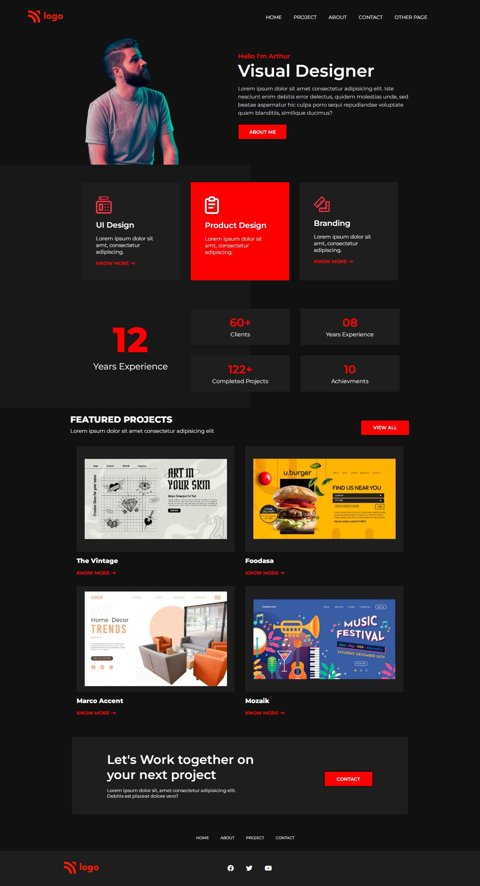

# Project 15 - Product Design Landing Page

  

 

[DEPLOYED WEBSITE LINK](https://fsbproject15.netlify.app/)

## What I learned from this Project?

- I Learned to create background box for visual design.
- Learned to use external fontawesome icon library

## Completed the project in **3 hours 30 minutes**.